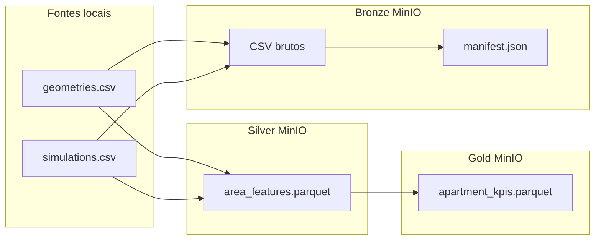

# Governança e arquitetura Medallion — Home Swiss Home

Este documento descreve a separação **Bronze / Silver / Gold** aplicada ao dataset suíço de arquitetura (fontes `geometries.csv` e `simulations.csv`), os métodos usados em cada camada, o versionamento e como reproduzir o pipeline.

---

## 1. Contexto de negócio

A empresa fictícia **Home Swiss Home** precisa estruturar dados técnicos de apartamentos na Suíça para análise e modelagem: geometrias de ambientes (polígonos WKT) e métricas de simulação (sol, ruído, vista, conectividade do layout, etc.). A camada Medallion organiza **qualidade, rastreabilidade e consumo** sem misturar “dado bruto” com “dado pronto para produto”.

---

## 2. Visão geral das três camadas

| Camada | Propósito | Conteúdo neste projeto | Formato típico |
|--------|-----------|-------------------------|----------------|
| **Bronze** | Cópia fiel da fonte; auditoria e replay | `geometries.csv`, `simulations.csv` idênticos ao arquivo original + `manifest.json` | CSV + JSON |
| **Silver** | Limpeza, tipagem, integração por chave | Uma tabela analítica por **área** (`apartment_id` + `area_id`) com métricas de simulations + `geometry_entity_count` | Parquet (Snappy) |
| **Gold** | Agregação por **apartamento** para KPIs e ML | Médias das métricas numéricas de domínio por `apartment_id` + `n_areas_in_sample` | Parquet (Snappy) |

---

## 3. Fontes de dados (referência)

### 3.1 `geometries.csv`

- **Granularidade:** uma linha por entidade geométrica (ex.: `ROOM`, `BALCONY`, `KITCHEN`).
- **Chaves principais:** `apartment_id`, `area_id`, `building_id`, `floor_id`, `site_id`, `unit_id`.
- **Dado principal:** coluna `geometry` em texto **WKT** (`POLYGON (...)`).
- **Papel na Bronze:** preservado integralmente (texto e nomes de colunas).

### 3.2 `simulations.csv`

- **Granularidade:** tipicamente **uma linha por área** (`apartment_id` + `area_id`) com métricas agregadas de simulação.
- **Famílias de colunas (exemplos):** `connectivity_*`, `layout_*`, `noise_*`, `sun_*`, `view_*`, `window_noise_*`, etc.
- **Papel na Bronze:** preservado integralmente.

---

## 4. Camada Bronze — método

**Objetivo:** garantir **imutabilidade lógica** da ingestão e rastreabilidade.

**Passos:**

1. Leitura dos arquivos locais (caminhos configuráveis por variável de ambiente ou padrão).
2. Upload para o **MinIO** (API S3) no bucket `homesswiss` (configurável).
3. Caminho no objeto: `bronze/<versão>/geometries.csv`, `bronze/<versão>/simulations.csv`.
4. Cálculo de **SHA-256** por arquivo e tamanho em bytes.
5. Geração de `bronze/<versão>/manifest.json` com: `ingested_at_utc`, lista de arquivos, chaves S3, hashes.

**Não** são aplicadas transformações de negócio na Bronze (sem drop de colunas, sem médias).

**Versionamento:** pasta `versão` (ex.: `2025-04-05` ou `test-2026-04-05`), definida por `DATASET_VERSION`.

---

## 5. Camada Silver — método

**Objetivo:** dados **limpos, tipados e relacionáveis** para análise.

**Passos principais:**

1. **Contagem de entidades geométricas** por (`apartment_id`, `area_id`) a partir de `geometries.csv`, em blocos (chunked), para não carregar o arquivo inteiro na memória.
2. Normalização de chaves:
   - `apartment_id`: texto com `strip`.
   - `area_id`: `Int64` (nullable) após conversão numérica (alinha `273715.0` com `273711`).
3. Leitura de `simulations.csv` também em **blocos**, com enriquecimento:
   - `geometry_entity_count` = número de linhas geométricas daquele par apartamento+área (0 se não houver geometria correspondente).
4. Escrita **incremental** para **Parquet** (compressão Snappy) com esquema fixo no primeiro bloco, para estabilidade de tipos.
5. Upload: `silver/<versão>/area_features.parquet`.

**Arquivo de saída:** `area_features.parquet` — uma linha por linha de simulations (por área), já enriquecida.

**Parâmetro `--max-rows`:** limita o total de linhas processadas de simulations (útil para testes em máquinas com menos RAM). Para carga completa, omita o parâmetro (alto uso de CPU/RAM e tempo).

---

## 6. Camada Gold — método

**Objetivo:** visão **por apartamento** (KPIs), alinhada ao uso em modelos e dashboards.

**Passos:**

1. Leitura do Parquet Silver `area_features.parquet` a partir do MinIO (objeto `silver/<versão>/area_features.parquet`).
2. Seleção de colunas numéricas relevantes por prefixo: `sun_`, `noise_`, `view_`, `connectivity_`, `layout_`, `window_noise_` (se existirem).
3. **Agregação:** `groupby(apartment_id)` com **média** dessas colunas; prefixo `avg__` no nome da coluna de saída.
4. Métrica adicional: `n_areas_in_sample` = quantidade de áreas (linhas Silver) por apartamento na amostra processada.
5. Upload: `gold/<versão>/apartment_kpis.parquet`.

**Observação:** se a Silver tiver sido gerada com `--max-rows`, a Gold reflete **apenas** essa amostra; para produção, rode a Silver sem limite (ou com limite consciente alinhado ao experimento).

---

## 7. MinIO — layout de buckets e chaves

- **Bucket:** `homesswiss` (variável `HOME_SWISS_BUCKET`).
- **Estrutura:**
  - `bronze/<versão>/...`
  - `silver/<versão>/...`
  - `gold/<versão>/...`

**Credenciais padrão (local Docker):** `minio` / `minio123`, endpoint `http://127.0.0.1:9000`.

---

## 8. Metadados no PostgreSQL (opcional)

A tabela `swiss_pipeline_runs` (no banco configurado por `SWISS_PG_URI`, padrão `mlflow` no compose) registra cada execução de camada com JSON em `payload`.

Script SQL: [`sql/swiss_pipeline_runs.sql`](../sql/swiss_pipeline_runs.sql).

Se o Postgres não estiver acessível ou `psycopg2` não estiver instalado, o pipeline **continua** e apenas não grava metadados SQL.

---

## 9. Como executar o pipeline

Pré-requisitos: **Docker Compose** no ar (MinIO + Postgres), Python **3.12+** com dependências:

```bash
cd projeto-ia
py -3.12 -m pip install -r requirements-pipeline.txt
```

Definir variáveis se os CSVs não estiverem na pasta pai padrão:

```powershell
$env:GEOMETRIES_CSV="C:\caminho\geometries.csv"
$env:SIMULATIONS_CSV="C:\caminho\simulations.csv"
$env:DATASET_VERSION="2025-04-05"
```

Execução completa (teste com limite de linhas):

```powershell
py -3.12 -m pipeline.run_pipeline --max-rows 10000
```

Carga completa (demorada; requer máquina robusta):

```powershell
py -3.12 -m pipeline.run_pipeline
```

Pular etapas:

```powershell
py -3.12 -m pipeline.run_pipeline --skip-bronze --skip-silver
```

---

## 10. Módulos Python (referência)

| Módulo | Função |
|--------|--------|
| `pipeline/config.py` | Endpoints MinIO, bucket, paths, versão, URI Postgres |
| `pipeline/s3_utils.py` | Cliente boto3, criação de bucket, upload, SHA-256 |
| `pipeline/bronze.py` | Ingestão Bronze + manifest |
| `pipeline/silver.py` | Transformação Silver + Parquet streaming |
| `pipeline/gold.py` | Agregação Gold |
| `pipeline/metadata_db.py` | INSERT em `swiss_pipeline_runs` |
| `pipeline/run_pipeline.py` | CLI / orquestração |

---

## 11. Governança (resumo para entrega acadêmica)

- **Dono dos dados:** time Home Swiss Home (PO + time Scrum).
- **Versionamento:** pasta `versão` no object storage + manifest Bronze + opcionalmente linhas em `swiss_pipeline_runs`.
- **Qualidade:** Silver aplica tipos e chaves; Gold documenta agregação por prefixo de coluna.
- **Reprocessamento:** reexecutar com nova `DATASET_VERSION` sem sobrescrever versões antigas.
- **Segurança:** credenciais MinIO apenas em ambiente local; não commitar segredos.

---

## 12. Diagrama de fluxo (resumo)



---

*Documento gerado para o projeto acadêmico FACENS — Home Swiss Home (camada Medallion / Sprint 3).*
