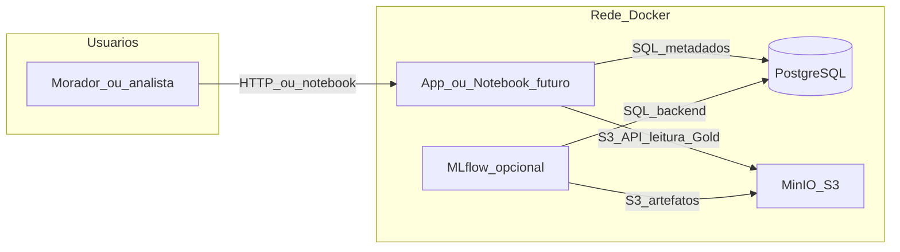

## Turma
TAN1

## PO
- João Antonio Tonollo da Silva RA: 222652

## Grupo
- Bruno Bagatella RA: 211653
- Eduardo Henrique dos Santos de Souza Lima RA: 211990
- Fábio Boemer Figueira RA: 211999
- Gabriel Oliveira Ventura da Costa RA: 212086
- Gustavo Gonçalves Tuda RA: 222919
- João Antonio Tonollo da Silva RA: 222652
- João Vitor Fragoso de Camargo RA: 212057
- João Pedro Sanches Rodrigues RA: 223205
- Lucas Rogério do Couto RA: 223466
- Matheus Benite Disegna RA: 211958
- Vinícius Muniz Ferraz RA: 212190
- Sivaldo Castro Araújo Neto RA: 212181

## Tema
Arquitetura - https://github.com/awesomedata/awesome-public-datasets?tab=readme-ov-file#architecture

## Nome da Empresa:
Home Swiss Home

## Objetivo:
Criar um RAG capaz de analisar apartamentos localizados na Suíça e identificar ao usuário quais estão disponíveis, suas características, e definir qual a casa mais adequada para o usuário de acordo com suas preferências.

## Problema de negócio:
Moradores e interessados em imóveis na Suíça precisam comparar apartamentos além de preço e metragem: iluminação natural, ruído, vista, conectividade do layout etc. Essas informações estão espalhadas em dados técnicos volumosos (geometrias e simulações), difíceis de consultar sem ferramenta. A Home Swiss Home quer oferecer uma forma acessível (ex.: perguntas em linguagem natural via RAG) de explorar características dos apartamentos do dataset e receber explicações alinhadas às preferências do usuário (ex.: “priorizo silêncio à noite” ou “quero muita luz natural”).

##Requisitos

| ID   | Requisito                                                                                                  |
| ---- | ---------------------------------------------------------------------------------------------------------- |
| RF01 | Permitir consulta em linguagem natural sobre apartamentos/cômodos (RAG).                                   |
| RF02 | Filtrar ou ranquear apartamentos por atributos do `simulations.csv` (ex.: ruído noturno, métricas de sol). |
| RF03 | Expor metadados de origem (Zenodo, versão, licença CC-BY-4.0).                                             |
| RF04 | (Futuro) Integrar ou simular “disponibilidade” se o produto for além do dataset estático.                  |

### Diagrama

