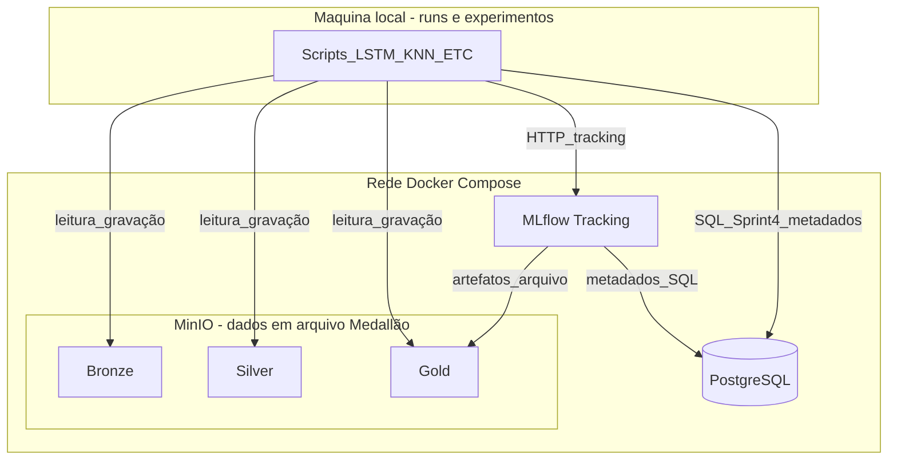

## Turma
TAN1

## PO
- João Antonio Tonollo da Silva RA: 222652

## Grupo
- Bruno Bagatella RA: 211653
- Eduardo Henrique dos Santos de Souza Lima RA: 211990
- Fábio Boemer Figueira RA: 211999
- Gabriel Oliveira Ventura da Costa RA: 212086
- Gustavo Gonçalves Tuda RA: 222919
- João Antonio Tonollo da Silva RA: 222652
- João Vitor Fragoso de Camargo RA: 212057
- João Pedro Sanches Rodrigues RA: 223205
- Lucas Rogério do Couto RA: 223466
- Matheus Benite Disegna RA: 211958
- Vinícius Muniz Ferraz RA: 212190
- Sivaldo Castro Araújo Neto RA: 212181

## Tema
Arquitetura - https://github.com/awesomedata/awesome-public-datasets?tab=readme-ov-file#architecture

## Nome da Empresa:
Home Swiss Home

## Objetivo:
Construir a **base de dados em camadas Medallion (Bronze / Silver / Gold)** sobre o dataset suíço, com **scripts** (ETL e treino de modelo) lendo e gravando no **MinIO**, **metadados e versionamento em PostgreSQL** e **MLflow** registrando experimentos, métricas e artefatos. **Sem API e sem RAG neste ciclo** — foco em dados, pipeline e MLOps leve.

## Problema de negócio:
Moradores e interessados em imóveis na Suíça precisam comparar apartamentos além de preço e metragem: iluminação natural, ruído, vista, conectividade do layout etc. Essas informações estão em dados técnicos volumosos (geometrias e simulações). O projeto consiste em **estruturar esses dados**, **governança** e **experimentos de modelagem**.

## Dados brutos (fora do Git)

Os arquivos **`geometries.csv`** e **`simulations.csv`** não são versionados (`.gitignore`) por serem muito grandes para o GitHub.

**Fonte:** dataset **Swiss Dwellings**, obtido por download no **Zenodo**: [https://zenodo.org/records/7070952](https://zenodo.org/records/7070952) — DOI [10.5281/zenodo.7070952](https://doi.org/10.5281/zenodo.7070952). Licença **CC-BY-4.0** (atribuir a fonte ao usar).

**Uso local:** após baixar, coloque os dois CSV na **raiz deste repositório** (`projeto-ia/`), ao lado do `readme.md`, para o pipeline Medallion encontrá-los por padrão. Detalhes em [`docs/MEDALLION_GOVERNANCA.md`](docs/MEDALLION_GOVERNANCA.md).

### Diagrama (arquitetura até Sprint 4 — sem API / sem RAG)

Fluxo: **scripts** (local ou container) orquestram ETL e treino; **MinIO** guarda Bronze, Silver e Gold; **MLflow** registra runs e pode armazenar artefatos no mesmo MinIO; **PostgreSQL** serve ao backend do MLflow e às tabelas de metadados do dataset.

**Legenda:** igual ao quadro — **runs/experimentos** (scripts: ETL, LSTM, KNN…) trocam dados com **MinIO + Postgres**; **MLflow** guarda **metadados** no Postgres e **artefatos** (modelos, etc.) como arquivos no MinIO.

