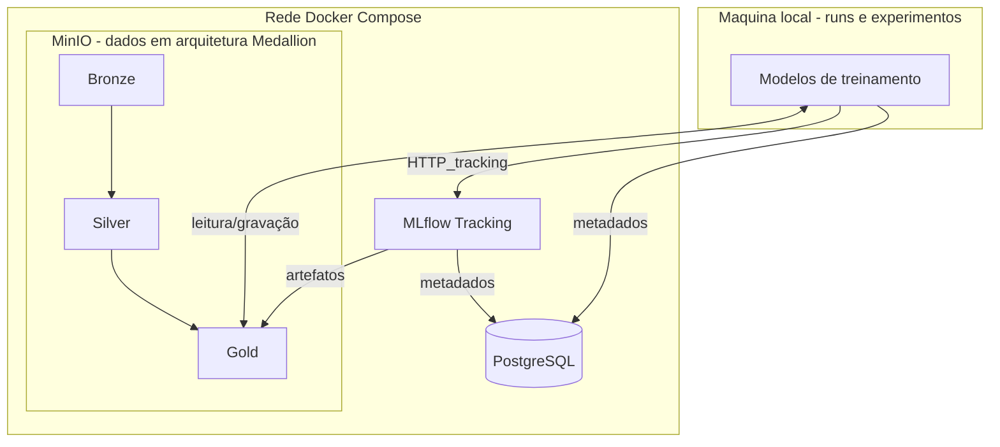

## Turma
TAN1

## Product Owner (PO)
- João Antonio Tonollo da Silva RA: 222652

## Grupo
- Bruno Bagatella RA: 211653
- Eduardo Henrique dos Santos de Souza Lima RA: 211990
- Fábio Boemer Figueira RA: 211999
- Gabriel Oliveira Ventura da Costa RA: 212086
- Gustavo Gonçalves Tuda RA: 222919
- João Antonio Tonollo da Silva RA: 222652
- João Vitor Fragoso de Camargo RA: 212057
- João Pedro Sanches Rodrigues RA: 223205
- Lucas Rogério do Couto RA: 223466
- Matheus Benite Disegna RA: 211958
- Vinícius Muniz Ferraz RA: 212190
- Sivaldo Castro Araújo Neto RA: 212181

## Tema
**Arquitetura** - Dataset "*Swiss Dwellings*", obtido por download no **Zenodo**: [https://zenodo.org/records/7070952](https://zenodo.org/records/7070952) — DOI [10.5281/zenodo.7070952](https://doi.org/10.5281/zenodo.7070952). Licença **CC-BY-4.0**

## Nome da Empresa:
***"Home Swiss Home"***

## Problema de negócio:
Durante a busca por um imóvel ideal, moradores e interessados são facilmente atraídos pelas características de preço e metragem de uma determinada propriedade, desconsiderando outros aspectos importantes como a incidência de iluminação natural, poluição sonora e visual, layout, localização, entre outras. Até mesmo os clientes mais observadores que buscam se informar sobre todas essas características podem acabar se deparando com uma falta de informações por parte do vendedor, dificultando uma tomada de decisão certeira.

## Objetivo:
Com esse projeto, a equipe teve como objetivo a construção de uma pipeline de treinamento funcional com algoritmos de regressão que utilizam o dataset "*Swiss Dwellings*" como dados de treinamento, tendo como finalidade prever os atributos de **qualidade ambiental (`target_env_quality`)** e **conforto luminoso (`target_light_comfort`)** dos apartamentos do dataset. 

Para tal, os arquivos de dados presentes no dataset serão organizados considerando a arquitetura **Medallion (Camadas Bronze / Silver / Gold)** e armazenados na plataforma **MinIO**. Em seguida, os dados da camada Gold serão utilizados por cinco algoritmos de regressão diferentes, sendo eles: **Regressão Linear**, **Regressão Ridge**, **K-Nearest Neighbors (KNN)**, **Random Forest** e **Extreme Gradient Boosting (XGBoost)**. Todos os modelos treinados ficarão armazenados no **MiniIO** e os seus metadados no **PostgreSQL**. Por fim, a plataforma **MLFlow** permitirá a análise das métricas de cada modelo armazenado para determinar qual é o mais capaz de prever a qualidade ambiental e o conforto luminoso de um determinado apartamento.

## Funcionamento:
### 1. Origem e organização dos dados
O projeto utilizou os dois arquivos principais presentes no dataset "*Swiss Dwellings*": **`geometries.csv`** e **`simulations.csv`**. 
- **`geometries.csv`**: Contém os dados estruturais de cada apartamento e a sua localização;
- **`simulations.csv`**: Contém dados adicionais sobre incidênciade luz solar, poluição sonora e visual, vegetação, entre outros;

Os dados brutos nesses dois arquivos passam por uma arquitetura **Medallion**, sendo organizados nas camadas **Bronze**, **Silver** e **Gold** e armazenados na plataforma ***MinIO***.
- **Bronze**: Cópia fiel dos CSVs brutos no *MinIO*, com manifest.json e SHA-256. Gerado o arquivo `bronze/<versão>/`;
- **Silver**: Dados limpos, tipados e integrados por `apartment_id` e `area_id`. Gerado o arquivo `silver/<versão>/area_features.parquet`;
- **Gold**: Agregação por apartamento com médias das famílias numéricas. Gerado o arquivo `gold/<versão>/apartment_kpis.parquet`, que será utilizado por todos os modelos a serem treinados;

### 2. Fluxo de treinamento
#### 2.1 Problema e Alvos
O primeiro passo para o treinamento é a definição do problema em que o modelo deverá ser treinado para resolver, considerando os alvos que devem ser obtidos. Como citado no objetivo, os alvos escolhidos são os atributos de **qualidade ambiental (`target_env_quality`)** e **conforto luminoso (`target_light_comfort`)** de cada apartamento. Visto que esses serão números reais contínuos, o problema será uma **Regressão**.
- **Qualidade ambiental (`target_env_quality`)**: É um índice composto entre 0 e 1. Ele combina três dimensões: luz, vista e ruído. Luz e vista aumentam o índice e o ruído o diminui, pois menor ruído significa maior qualidade ambiental. Sua fórmula conceitual é: $EQ = \\frac{L + V + N_{inv}}{3}$, onde *L* é luz normalizada, *V* é vista normalizada e $N_{inv}$ é 1 menos o ruído normalizado;
- **Conforto Luminoso (`target_light_comfort`)**: É calculado como a média de todas as colunas `avg__sun_*` da camada Gold, ou seja, uma média da incidência solar no decorrer do dia. Quanto maior o valor, maior a exposição luminosa média simulada;
#### 2.2 Métricas de avaliação
As principais métricas utilizadas para justificar a qualidade de cada modelo foram:
- **Mean Absolute Error (MAE)**: Mede a magnitude média dos erros em um conjunto de previsões. Fácil de interpretar;
- **Root Mean Square Error (RMSE)**: Mede a diferença média entre valores previstos e observados, penalizando mais os erros;
- **Coeficiente de Determinação ($R^2$)**: Indica o quão bem o modelo explica a variância dos dados observados. É a métrica principal para determinar a qualidade do modelo, visto que indica o quão **generalista** ele é;
- **Mean Absolute Percentage Error (MAPE)**: Indica o quão distantes as previsões estão dos valores reais, em porcentagem;
#### 2.3 Modelos de Treinamento
Os modelos utilizados para o treinamento foram:
- **Regressão Linear**: Modelo simples e interpretável, serve como base para determinar o desempenho mínimo esperado dos outros modelos;
- **Regressão Ridge**: Linear com regularização L2, útil com colunas correlacionadas, útil para testar se a regularização melhora estabilidade;
- **K-Nearest Neighbors (KNN)**: Modelo não-paramétrico baseado em vizinhança, captura padrões locais sem assumir forma linear;
- **Random Forest**: Conjunto de árvores robusto a não-linearidades e interações, bom modelo para tabular;
- **Extreme Gradient Boosting (XGBoost)**: Booster de árvores, é o estado da arte em dados tabulares, sendo o modelo de maior capacidade preditiva;
#### 2.4 Runs e o papel do MLFlow
O treinamento pode ser iniciado pelos scripts [`ml/train.py`](../ml/train.py) (treina um modelo específico) e [`ml/run_all.py`](../ml/run_all.py) (treina todos os modelos definidos). Cada execução de treino cria uma run no experimento home_swiss_home, registrado no **MlFlow**, junto das tags, parâmetros, métricas, artefatos de dataset e o modelo serializado como Logged Model.
### 3. Diagrama Arquitetural

## 4. Resultados

